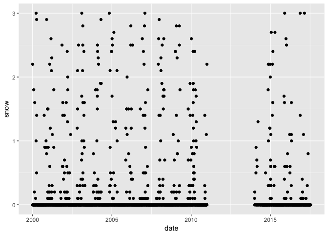
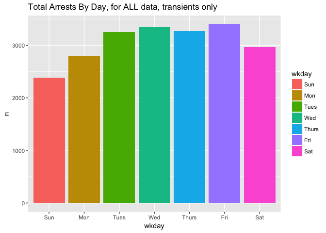
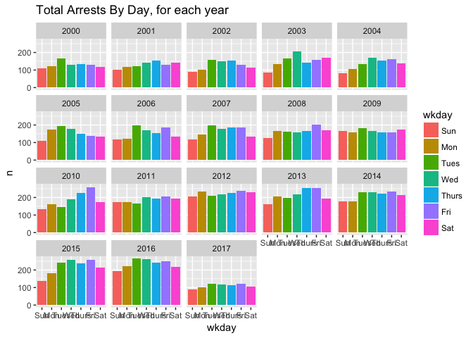
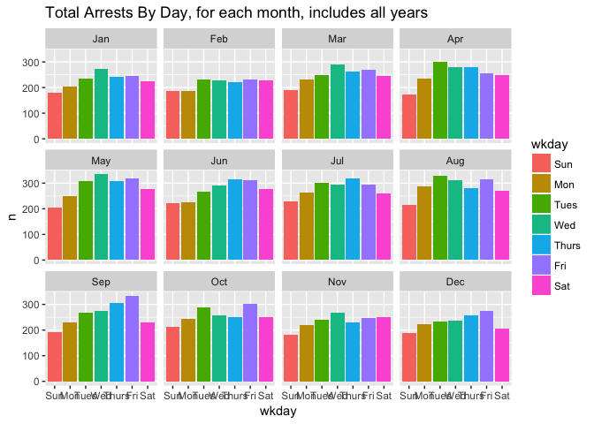

# BoCo EDA - Andy Pickering


# Introduction

- This project is looking at patterns of homelessness-related arrests and possible relationship to weather in Boulder County. 
- It was started by Sam Zhang, who gathered and merged the data: <https://github.com/samzhang111/boco-jail-analysis>.
- Data is in a Google drive folder shared by Sam, which I have synced locally on my machine.
- This analysis is in a github repository: <https://github.com/andypicke/boco_homeless>

## Hypotheses To Explore
- How does weather affect daily bookings? weather: *downtown-boulder-weather.csv*. bookings: *bookings-with-transient-status.csv* (you'll need to aggregate this one up to the daily level)
- What proportion of jail bookings for housed/unhoused folks are for homelessness related charges? (by department? by year?) we pulled out charges that came from a list of antihomelessness ordinances compiled by some folks at Denver University, and marked them in the bookings dataset. If any of them were true, we marked the *antihomeless* column as true.


# Weather

- Add more details about where weather data comes from (on Sam's github?)
- What is *SNWD*? Some kind of accumulated snowfall?
- What are *WT01*,*WT02* etc.?
- *SNOW* is missing data from about 2011-204?


```r
suppressPackageStartupMessages(library(dplyr))
library(readr)
suppressPackageStartupMessages(library(lubridate))
library(ggplot2)
```

## Load weather data

```r
wea <- read_csv('/Users/Andy/Google Drive/boco-jail/downtown-boulder-weather.csv',col_types = cols())
glimpse(wea)
```

```
## Observations: 6,400
## Variables: 12
## $ DATE <int> 20000101, 20000102, 20000103, 20000104, 20000105, 2000010...
## $ PRCP <dbl> 0.00, 0.00, 0.08, 0.00, 0.00, 0.00, 0.00, 0.00, 0.00, 0.0...
## $ SNOW <dbl> 0.0, 0.0, 2.2, 0.0, 0.0, 0.0, 0.0, 0.0, 0.0, 0.0, 0.0, 0....
## $ SNWD <chr> NA, NA, NA, NA, NA, NA, NA, NA, NA, NA, NA, NA, NA, NA, N...
## $ TMAX <dbl> 54, 40, 36, 49, 47, 42, 47, 50, 45, 42, 61, 58, 41, 64, 6...
## $ TMIN <dbl> 29, 22, 19, 13, 26, 16, 19, 23, 29, 30, 17, 41, 25, 25, 3...
## $ WT01 <dbl> NA, NA, NA, NA, NA, NA, NA, NA, NA, NA, NA, NA, NA, NA, N...
## $ WT03 <dbl> NA, NA, NA, NA, NA, NA, NA, NA, NA, NA, NA, NA, NA, NA, N...
## $ WT04 <chr> NA, NA, NA, NA, NA, NA, NA, NA, NA, NA, NA, NA, NA, NA, N...
## $ WT05 <dbl> NA, NA, NA, NA, NA, NA, NA, NA, NA, NA, NA, NA, NA, NA, N...
## $ WT06 <dbl> NA, NA, NA, NA, NA, NA, NA, NA, NA, NA, NA, NA, NA, NA, N...
## $ WT11 <dbl> NA, NA, NA, NA, NA, NA, NA, NA, NA, NA, NA, NA, NA, NA, N...
```


```r
summary(wea)
```

```
##       DATE               PRCP              SNOW             SNWD          
##  Min.   :20000101   Min.   :0.00000   Min.   : 0.0000   Length:6400       
##  1st Qu.:20040519   1st Qu.:0.00000   1st Qu.: 0.0000   Class :character  
##  Median :20081004   Median :0.00000   Median : 0.0000   Mode  :character  
##  Mean   :20083356   Mean   :0.05655   Mean   : 0.2372                     
##  3rd Qu.:20130222   3rd Qu.:0.01000   3rd Qu.: 0.0000                     
##  Max.   :20170714   Max.   :9.08000   Max.   :16.7000                     
##                     NA's   :5         NA's   :1190                        
##       TMAX             TMIN             WT01           WT03     
##  Min.   :  6.00   Min.   :-17.00   Min.   :1      Min.   :1     
##  1st Qu.: 53.00   1st Qu.: 27.00   1st Qu.:1      1st Qu.:1     
##  Median : 67.00   Median : 38.00   Median :1      Median :1     
##  Mean   : 65.99   Mean   : 38.17   Mean   :1      Mean   :1     
##  3rd Qu.: 81.00   3rd Qu.: 51.00   3rd Qu.:1      3rd Qu.:1     
##  Max.   :102.00   Max.   : 77.00   Max.   :1      Max.   :1     
##  NA's   :1        NA's   :3        NA's   :6304   NA's   :5623  
##      WT04                WT05           WT06           WT11     
##  Length:6400        Min.   :1      Min.   :1      Min.   :1     
##  Class :character   1st Qu.:1      1st Qu.:1      1st Qu.:1     
##  Mode  :character   Median :1      Median :1      Median :1     
##                     Mean   :1      Mean   :1      Mean   :1     
##                     3rd Qu.:1      3rd Qu.:1      3rd Qu.:1     
##                     Max.   :1      Max.   :1      Max.   :1     
##                     NA's   :6337   NA's   :6370   NA's   :6331
```


```r
wea$DATE <- lubridate::ymd(wea$DATE)
wea <- wea %>% select( DATE,PRCP,SNOW,TMAX,TMIN)
head(wea)
```

```
## # A tibble: 6 x 5
##         DATE  PRCP  SNOW  TMAX  TMIN
##       <date> <dbl> <dbl> <dbl> <dbl>
## 1 2000-01-01  0.00   0.0    54    29
## 2 2000-01-02  0.00   0.0    40    22
## 3 2000-01-03  0.08   2.2    36    19
## 4 2000-01-04  0.00   0.0    49    13
## 5 2000-01-05  0.00   0.0    47    26
## 6 2000-01-06  0.00   0.0    42    16
```


## Plot temperature timeseries

```r
wea %>%
        ggplot(aes(DATE,TMAX))+
        geom_point() +
        ylab('Max Temp') +
        ggtitle('Downtown Boulder Weather')
```

```
## Warning: Removed 1 rows containing missing values (geom_point).
```

<!-- -->

## Plot precipiation timeseries
- I assume in inches?

```r
wea %>%
        ggplot(aes(DATE,PRCP))+
        geom_point() +
        ylim(0,3)
```

```
## Warning: Removed 7 rows containing missing values (geom_point).
```

<!-- -->


## Plot snow timeseries 
- I assume this is daily snow fall in inches?
- Looks like we are missing a chunk of snowfall data from about 2011-2014 (pretty sure it snowed during those years :) )

```r
wea %>%
        ggplot(aes(DATE,SNOW))+
        geom_point() +
        ylim(0,3)
```

```
## Warning: Removed 1334 rows containing missing values (geom_point).
```

<!-- -->


# Bookings

Some info on the *bookings-with-transient-status.csv* data:
- (Sam) These are bookings in Boulder County Jail only.
- (Sam) Each row is an individual booking.
- (Sam) `boulder` means the arrest was made by Boulder PD
- (Sam) Column `transient` for whether someone was homeless or not.
- (Sam) I created indicator variables for a variety of antihomeless charges (that a local law school came up with). `antihomeless` is true if any of the antihomeless charges existed in the booking. So one source of error could be that if someone was arrested for an antihomeless charge AND a more serious offense, I still mark it as "antihomeless". 
- (Sam) I don't remember making `any_antihomeless` -- I suspect it's identical to `antihomeless` and introduced by accident
- (Andy) There are two *Booking Time* columns? I will use *booking_time* for now, as it seems better.
- (Andy) What are *location*s? Is that where they were booked?

## Load bookings data

```r
bk <- read_csv('/Users/Andy/Google Drive/boco-jail/bookings-with-transient-status.csv',col_types = cols())
```

```
## Warning in rbind(names(probs), probs_f): number of columns of result is not
## a multiple of vector length (arg 1)
```

```
## Warning: 46578 parsing failures.
## row # A tibble: 5 x 5 col     row     col               expected actual expected   <int>   <chr>                  <chr>  <chr> actual 1  1537 Case No no trailing characters     .0 file 2  1539 Case No no trailing characters     .0 row 3  1540 Case No no trailing characters     .0 col 4  1541 Case No no trailing characters     .0 expected 5  1542 Case No no trailing characters     .0 actual # ... with 1 more variables: file <chr>
## ... ................. ... ............................................. ........ ............................................. ...... ............................................. .... ............................................. ... ............................................. ... ............................................. ........ ............................................. ...... .......................................
## See problems(...) for more details.
```

```r
glimpse(bk)
```

```
## Observations: 167,633
## Variables: 30
## $ Name                 <chr> "HOOD,AARON JAY", "LAWYER,KENNETH A", "AG...
## $ Booked               <dttm> 2000-01-01 02:12:00, 2000-01-01 04:01:00...
## $ Location             <chr> NA, NA, NA, NA, NA, NA, NA, NA, NA, NA, N...
## $ DOB                  <date> 1975-10-08, 1958-09-29, 1972-11-14, 1953...
## $ Race                 <chr> "W", "W", "W", "W", "W", "W", "W", "W", "...
## $ Sex                  <chr> "M", "M", "M", "M", "M", "M", "M", "M", "...
## $ Case No              <int> 991126052, 991001313, 991126053, 99103193...
## $ Arresting Agency     <chr> "UNIVERSITY OF COLORADO", "JAIL MITTS ONL...
## $ Arrest Date          <date> 1999-12-31, 2000-01-16, 1999-12-31, 1999...
## $ camping              <chr> "False", "False", "False", "False", "Fals...
## $ fta                  <chr> "True", "False", "False", "False", "False...
## $ ftc                  <chr> "False", "False", "False", "False", "Fals...
## $ booking_time         <dttm> 2000-01-01 02:12:00, 2000-01-01 04:01:00...
## $ boulder              <chr> "False", "False", "False", "False", "Fals...
## $ urination            <chr> "False", "False", "False", "False", "Fals...
## $ vehicle_as_residence <chr> "False", "False", "False", "False", "Fals...
## $ public_obstruct      <chr> "False", "False", "False", "False", "Fals...
## $ public_trespass      <chr> "False", "False", "False", "False", "Fals...
## $ begging              <chr> "False", "False", "False", "False", "Fals...
## $ antihomeless         <chr> "False", "False", "False", "False", "Fals...
## $ smoking              <chr> "False", "False", "False", "False", "Fals...
## $ any_antihomeless     <chr> "False", "False", "False", "False", "Fals...
## $ Address              <chr> NA, NA, NA, NA, NA, NA, NA, NA, NA, NA, N...
## $ City                 <chr> NA, NA, NA, NA, NA, NA, NA, NA, NA, NA, N...
## $ State                <chr> NA, NA, NA, NA, NA, NA, NA, NA, NA, NA, N...
## $ ZIP Code             <dbl> NA, NA, NA, NA, NA, NA, NA, NA, NA, NA, N...
## $ Booking Date         <date> NA, NA, NA, NA, NA, NA, NA, NA, NA, NA, ...
## $ Booking Time         <dbl> NA, NA, NA, NA, NA, NA, NA, NA, NA, NA, N...
## $ Facility             <chr> NA, NA, NA, NA, NA, NA, NA, NA, NA, NA, N...
## $ transient            <chr> "False", "False", "False", "False", "Fals...
```


## Let's clean it up a little

```r
bk <- bk %>% select(-`Booking Time`)
names(bk) <- tolower(names(bk))
names(bk) <- gsub(' ','_',names(bk))
bk$arresting_agency <- as.factor(bk$arresting_agency)

to_log <- function(a_col){
        as.logical(a_col)
}
cols_to_log <- c('camping','boulder','urination','vehicle_as_residence','public_obstruct','public_trespass','begging','antihomeless','smoking','any_antihomeless','transient')
bk[cols_to_log] <- lapply(bk[cols_to_log],to_log)

glimpse(bk)
```

```
## Observations: 167,633
## Variables: 29
## $ name                 <chr> "HOOD,AARON JAY", "LAWYER,KENNETH A", "AG...
## $ booked               <dttm> 2000-01-01 02:12:00, 2000-01-01 04:01:00...
## $ location             <chr> NA, NA, NA, NA, NA, NA, NA, NA, NA, NA, N...
## $ dob                  <date> 1975-10-08, 1958-09-29, 1972-11-14, 1953...
## $ race                 <chr> "W", "W", "W", "W", "W", "W", "W", "W", "...
## $ sex                  <chr> "M", "M", "M", "M", "M", "M", "M", "M", "...
## $ case_no              <int> 991126052, 991001313, 991126053, 99103193...
## $ arresting_agency     <fctr> UNIVERSITY OF COLORADO, JAIL MITTS ONLY,...
## $ arrest_date          <date> 1999-12-31, 2000-01-16, 1999-12-31, 1999...
## $ camping              <lgl> FALSE, FALSE, FALSE, FALSE, FALSE, FALSE,...
## $ fta                  <chr> "True", "False", "False", "False", "False...
## $ ftc                  <chr> "False", "False", "False", "False", "Fals...
## $ booking_time         <dttm> 2000-01-01 02:12:00, 2000-01-01 04:01:00...
## $ boulder              <lgl> FALSE, FALSE, FALSE, FALSE, FALSE, FALSE,...
## $ urination            <lgl> FALSE, FALSE, FALSE, FALSE, FALSE, FALSE,...
## $ vehicle_as_residence <lgl> FALSE, FALSE, FALSE, FALSE, FALSE, FALSE,...
## $ public_obstruct      <lgl> FALSE, FALSE, FALSE, FALSE, FALSE, FALSE,...
## $ public_trespass      <lgl> FALSE, FALSE, FALSE, FALSE, FALSE, FALSE,...
## $ begging              <lgl> FALSE, FALSE, FALSE, FALSE, FALSE, FALSE,...
## $ antihomeless         <lgl> FALSE, FALSE, FALSE, FALSE, FALSE, FALSE,...
## $ smoking              <lgl> FALSE, FALSE, FALSE, FALSE, FALSE, FALSE,...
## $ any_antihomeless     <lgl> FALSE, FALSE, FALSE, FALSE, FALSE, FALSE,...
## $ address              <chr> NA, NA, NA, NA, NA, NA, NA, NA, NA, NA, N...
## $ city                 <chr> NA, NA, NA, NA, NA, NA, NA, NA, NA, NA, N...
## $ state                <chr> NA, NA, NA, NA, NA, NA, NA, NA, NA, NA, N...
## $ zip_code             <dbl> NA, NA, NA, NA, NA, NA, NA, NA, NA, NA, N...
## $ booking_date         <date> NA, NA, NA, NA, NA, NA, NA, NA, NA, NA, ...
## $ facility             <chr> NA, NA, NA, NA, NA, NA, NA, NA, NA, NA, N...
## $ transient            <lgl> FALSE, FALSE, FALSE, FALSE, FALSE, FALSE,...
```


### What percent of arrestees are transient?

```r
mean(bk$transient,na.rm = TRUE)*100
```

```
## [1] 13.06127
```

### What percent of arrests are 'antihomeless' (true if any charges were related to 'antihomeless charges')

```r
mean(bk$antihomeless)*100
```

```
## [1] 1.324322
```

### What percent of arrests were made by Boulder PD?

```r
mean(bk$boulder)*100
```

```
## [1] 6.584026
```

###

```r
levels(bk$arresting_agency)
```

```
##  [1] "BOULDER COUNTY DRUG TASK FORCE" "BOULDER COUNTY SHERIFFS OFFICE"
##  [3] "BOULDER PD"                     "COLORADO STATE PATROL"         
##  [5] "COMMUNITY CORRECTIONS"          "DISTRICT ATTORNEYS OFFICE"     
##  [7] "ERIE PD"                        "JAIL MITTS ONLY"               
##  [9] "LAFAYETTE PD"                   "LONGMONT PD"                   
## [11] "LOUISVILLE PD"                  "NEDERLAND MARSHALS OFFICE"     
## [13] "OTHER"                          "PAROLE"                        
## [15] "STATE DIVISION OF WILDLIFE"     "UNIVERSITY OF COLORADO"        
## [17] "WARD MARSHALS OFFICE"
```


### What agencies have the most arrests?

```r
bk %>%
        group_by(arresting_agency) %>%
        tally() %>%
        arrange( desc(n) ) %>%
        ggplot(aes(x=reorder(arresting_agency,n),y=n))+
        geom_bar(stat='identity',aes(fill=arresting_agency)) +
        coord_flip()
```

<!-- -->


### Aggregate Monthly
- I thought there would be more arrests in winter, but there doesn't seem to be that big of a difference.


```r
bk$month_ <- lubridate::month(bk$arrest_date,label=TRUE)
bk$year <- lubridate::year(bk$arrest_date)
bk %>% 
        filter(year %in% c(2011,2012,2013,2015,2015)) %>%
        group_by(year,month_) %>%
        tally() %>%
        ggplot(aes(month_,n))+
        geom_point() +
        geom_bar(stat='identity',aes(fill=month_)) +
        facet_wrap(~year)
```

<!-- -->


### Aggregate by wkday


### Try aggregating to daily level?
- Looks like daily number of arrests is decreasing over time? 
- Not sure if actual, or something to do with how data is recorded.

```r
bk %>% 
        filter(arrest_date>"2000-01-01") %>%
        group_by(arrest_date) %>%
        tally() %>%
        ggplot(aes(arrest_date,n)) +
        geom_point(alpha=0.2) +
        ylim(0,60) +
        geom_smooth(method="lm")
```

<!-- -->


## Relationship between arrests and weather
- Scatter plot arrests vs weather variables
- Fit linear regressions between arrests and weather


