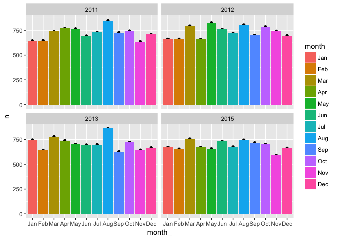
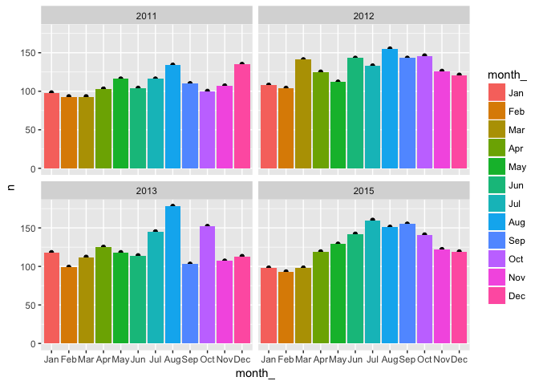

# EDA - Andy Pickering

# Title

## Introduction

### (From Sam) Some of the interesting hypotheses we haven't explored yet are:
- How does weather affect daily bookings? weather: downtown-boulder-weather.csv. bookings: bookings-with-transient-status.csv (you'll need to aggregate this one up to the daily level)
- What proportion of jail bookings for housed/unhoused folks are for homelessness related charges? (by department? by year?) we pulled out charges that came from a list of antihomelessness ordinances compiled by some folks at Denver University, and marked them in the bookings dataset. If any of them were true, we marked the "antihomeless" column as true.


```r
suppressPackageStartupMessages(library(dplyr))
library(readr)
suppressPackageStartupMessages(library(lubridate))
library(ggplot2)
```


# Weather


```r
wea <- read_csv('/Users/Andy/Google Drive/boco-jail/downtown-boulder-weather.csv')
```

```
## Parsed with column specification:
## cols(
##   DATE = col_integer(),
##   PRCP = col_double(),
##   SNOW = col_double(),
##   SNWD = col_character(),
##   TMAX = col_double(),
##   TMIN = col_double(),
##   WT01 = col_double(),
##   WT03 = col_double(),
##   WT04 = col_character(),
##   WT05 = col_double(),
##   WT06 = col_double(),
##   WT11 = col_double()
## )
```

```r
glimpse(wea)
```

```
## Observations: 6,400
## Variables: 12
## $ DATE <int> 20000101, 20000102, 20000103, 20000104, 20000105, 2000010...
## $ PRCP <dbl> 0.00, 0.00, 0.08, 0.00, 0.00, 0.00, 0.00, 0.00, 0.00, 0.0...
## $ SNOW <dbl> 0.0, 0.0, 2.2, 0.0, 0.0, 0.0, 0.0, 0.0, 0.0, 0.0, 0.0, 0....
## $ SNWD <chr> NA, NA, NA, NA, NA, NA, NA, NA, NA, NA, NA, NA, NA, NA, N...
## $ TMAX <dbl> 54, 40, 36, 49, 47, 42, 47, 50, 45, 42, 61, 58, 41, 64, 6...
## $ TMIN <dbl> 29, 22, 19, 13, 26, 16, 19, 23, 29, 30, 17, 41, 25, 25, 3...
## $ WT01 <dbl> NA, NA, NA, NA, NA, NA, NA, NA, NA, NA, NA, NA, NA, NA, N...
## $ WT03 <dbl> NA, NA, NA, NA, NA, NA, NA, NA, NA, NA, NA, NA, NA, NA, N...
## $ WT04 <chr> NA, NA, NA, NA, NA, NA, NA, NA, NA, NA, NA, NA, NA, NA, N...
## $ WT05 <dbl> NA, NA, NA, NA, NA, NA, NA, NA, NA, NA, NA, NA, NA, NA, N...
## $ WT06 <dbl> NA, NA, NA, NA, NA, NA, NA, NA, NA, NA, NA, NA, NA, NA, N...
## $ WT11 <dbl> NA, NA, NA, NA, NA, NA, NA, NA, NA, NA, NA, NA, NA, NA, N...
```


```r
wea$DATE <- lubridate::ymd(wea$DATE)
head(wea)
```

```
## # A tibble: 6 x 12
##         DATE  PRCP  SNOW  SNWD  TMAX  TMIN  WT01  WT03  WT04  WT05  WT06
##       <date> <dbl> <dbl> <chr> <dbl> <dbl> <dbl> <dbl> <chr> <dbl> <dbl>
## 1 2000-01-01  0.00   0.0  <NA>    54    29    NA    NA  <NA>    NA    NA
## 2 2000-01-02  0.00   0.0  <NA>    40    22    NA    NA  <NA>    NA    NA
## 3 2000-01-03  0.08   2.2  <NA>    36    19    NA    NA  <NA>    NA    NA
## 4 2000-01-04  0.00   0.0  <NA>    49    13    NA    NA  <NA>    NA    NA
## 5 2000-01-05  0.00   0.0  <NA>    47    26    NA    NA  <NA>    NA    NA
## 6 2000-01-06  0.00   0.0  <NA>    42    16    NA    NA  <NA>    NA    NA
## # ... with 1 more variables: WT11 <dbl>
```


```r
wea %>%
        ggplot(aes(DATE,TMAX))+
        geom_point() +
        ylab('Max Temp') +
        ggtitle('Downtown Boulder Weather')
```

```
## Warning: Removed 1 rows containing missing values (geom_point).
```

<!-- -->


```r
wea %>%
        ggplot(aes(DATE,PRCP))+
        geom_point() +
        ylim(0,3)
```

```
## Warning: Removed 7 rows containing missing values (geom_point).
```

<!-- -->


# Bookings

### Some info from Sam on the *bookings-with-transient-status.csv* data:
- These are bookings in Boulder County Jail.
- Each row was an individual booking.
- `boulder` means the arrest was made by Boulder PD
- Column `transient` for whether someone was homeless or not.
- I created indicator variables for a variety of antihomeless charges (that a local law school came up with). `antihomeless` is true if any of the antihomeless charges existed in the booking. So one source of error could be that if someone was arrested for an antihomeless charge AND a more serious offense, I still mark it as "antihomeless". 
- I don't remember making `any_antihomeless` -- I suspect it's identical to `antihomeless` and introduced by accident


```r
bk <- read_csv('/Users/Andy/Google Drive/boco-jail/bookings-with-transient-status.csv')
```

```
## Parsed with column specification:
## cols(
##   .default = col_character(),
##   Booked = col_datetime(format = ""),
##   DOB = col_date(format = ""),
##   `Case No` = col_integer(),
##   `Arrest Date` = col_date(format = ""),
##   booking_time = col_datetime(format = ""),
##   `ZIP Code` = col_double(),
##   `Booking Date` = col_date(format = ""),
##   `Booking Time` = col_double()
## )
```

```
## See spec(...) for full column specifications.
```

```
## Warning in rbind(names(probs), probs_f): number of columns of result is not
## a multiple of vector length (arg 1)
```

```
## Warning: 46578 parsing failures.
## row # A tibble: 5 x 5 col     row     col               expected actual expected   <int>   <chr>                  <chr>  <chr> actual 1  1537 Case No no trailing characters     .0 file 2  1539 Case No no trailing characters     .0 row 3  1540 Case No no trailing characters     .0 col 4  1541 Case No no trailing characters     .0 expected 5  1542 Case No no trailing characters     .0 actual # ... with 1 more variables: file <chr>
## ... ................. ... ............................................. ........ ............................................. ...... ............................................. .... ............................................. ... ............................................. ... ............................................. ........ ............................................. ...... .......................................
## See problems(...) for more details.
```

```r
glimpse(bk)
```

```
## Observations: 167,633
## Variables: 30
## $ Name                 <chr> "HOOD,AARON JAY", "LAWYER,KENNETH A", "AG...
## $ Booked               <dttm> 2000-01-01 02:12:00, 2000-01-01 04:01:00...
## $ Location             <chr> NA, NA, NA, NA, NA, NA, NA, NA, NA, NA, N...
## $ DOB                  <date> 1975-10-08, 1958-09-29, 1972-11-14, 1953...
## $ Race                 <chr> "W", "W", "W", "W", "W", "W", "W", "W", "...
## $ Sex                  <chr> "M", "M", "M", "M", "M", "M", "M", "M", "...
## $ Case No              <int> 991126052, 991001313, 991126053, 99103193...
## $ Arresting Agency     <chr> "UNIVERSITY OF COLORADO", "JAIL MITTS ONL...
## $ Arrest Date          <date> 1999-12-31, 2000-01-16, 1999-12-31, 1999...
## $ camping              <chr> "False", "False", "False", "False", "Fals...
## $ fta                  <chr> "True", "False", "False", "False", "False...
## $ ftc                  <chr> "False", "False", "False", "False", "Fals...
## $ booking_time         <dttm> 2000-01-01 02:12:00, 2000-01-01 04:01:00...
## $ boulder              <chr> "False", "False", "False", "False", "Fals...
## $ urination            <chr> "False", "False", "False", "False", "Fals...
## $ vehicle_as_residence <chr> "False", "False", "False", "False", "Fals...
## $ public_obstruct      <chr> "False", "False", "False", "False", "Fals...
## $ public_trespass      <chr> "False", "False", "False", "False", "Fals...
## $ begging              <chr> "False", "False", "False", "False", "Fals...
## $ antihomeless         <chr> "False", "False", "False", "False", "Fals...
## $ smoking              <chr> "False", "False", "False", "False", "Fals...
## $ any_antihomeless     <chr> "False", "False", "False", "False", "Fals...
## $ Address              <chr> NA, NA, NA, NA, NA, NA, NA, NA, NA, NA, N...
## $ City                 <chr> NA, NA, NA, NA, NA, NA, NA, NA, NA, NA, N...
## $ State                <chr> NA, NA, NA, NA, NA, NA, NA, NA, NA, NA, N...
## $ ZIP Code             <dbl> NA, NA, NA, NA, NA, NA, NA, NA, NA, NA, N...
## $ Booking Date         <date> NA, NA, NA, NA, NA, NA, NA, NA, NA, NA, ...
## $ Booking Time         <dbl> NA, NA, NA, NA, NA, NA, NA, NA, NA, NA, N...
## $ Facility             <chr> NA, NA, NA, NA, NA, NA, NA, NA, NA, NA, N...
## $ transient            <chr> "False", "False", "False", "False", "Fals...
```

### From Sam:
- Each row was an individual booking, with a column `transient` for whether someone was homeless or not.
- How many are transient?

```r
bk$transient = as.logical(bk$transient)
mean(bk$transient,na.rm = TRUE)
```

```
## [1] 0.1306127
```

- 'antihomeless' is if any charges were related to 'antihomeless charges'

```r
bk$antihomeless <- as.logical(bk$antihomeless)
mean(bk$antihomeless)
```

```
## [1] 0.01324322
```

### What percent of arrests were made by Boulder PD?

```r
bk$boulder <- as.logical(bk$boulder)
mean(bk$boulder)
```

```
## [1] 0.06584026
```


### Aggregate Monthly
- I thought there would be more arrests in winter, but there doesn't seem to be that big of a difference.


```r
bk$month_ <- lubridate::month(bk$`Arrest Date`,label=TRUE)
bk$year <- lubridate::year(bk$`Arrest Date`)
bk %>% 
        filter(year %in% c(2011,2012,2013,2015,2015)) %>%
        group_by(month_) %>%
        count() %>%
        ggplot(aes(month_,n))+
        geom_point() +
        geom_bar(stat='identity',aes(fill=month_))
```

<!-- -->


### Aggregate by wkday


### Try aggregating to daily level?

```r
bk %>% 
        filter(`Arrest Date`>"2000-01-01") %>%
        group_by(`Arrest Date`) %>%
        count() %>%
        ggplot(aes(`Arrest Date`,n)) +
        geom_point() +
        ylim(0,60) +
        geom_jitter() +
        geom_smooth(method="lm")
```

<!-- -->


## Relationship between arrests and weather


